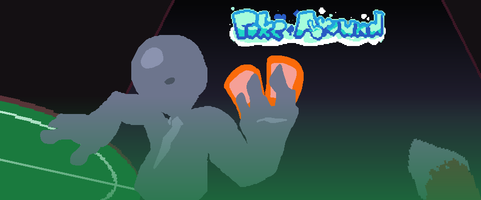
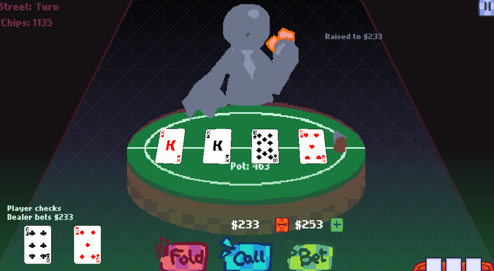
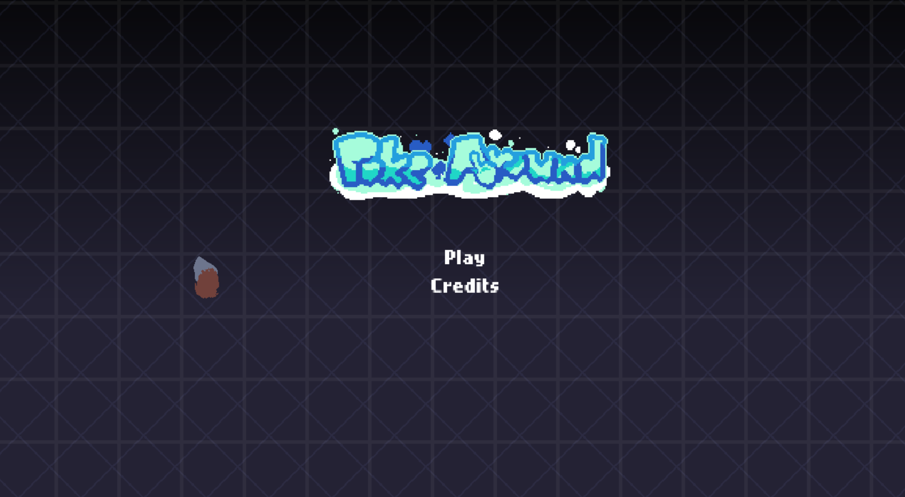

# [Poke-Around](https://mtunixic.itch.io/poke-around) (on itch.io)

### MADE FOR THE 2026 HAXEJAM GAMEJAM

Poker, but with a mix of buckshot roulette, and horsin' around with items to your advantage!

This game is based off of Old Poker, and in it your money is pretty much your health, lose it and you're eliminated (literally), use items to help yourself win and take a better advantage against the dealer to make sure you leave and win the round unscathed!

**TIP:** you must lose around 75$ or more before any items can show up

## Screenshots
 

# Credits:
- MTUnixic - Director, Coder, Artist, Animator, Composer
- Davvex87 - Co-Director, Coder
- chungus - Coder
- CodeAnomaly08 - Coder

# Building / Info:
This game was made in Haxe using the HaxeFlixel game framework/engine, and was built and run on HTML5.
